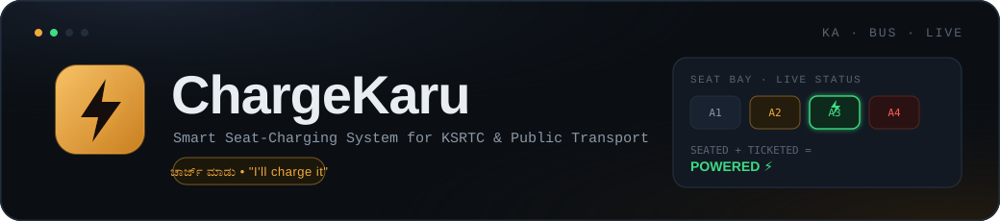

<div align="center">



*"Charge Karu"* → Kannada/Hindi for **"I'll charge it."**

A software-powered charging management system that enables USB charging **only** when a passenger is physically seated **and** holds a valid ticket or bus pass.

[](https://www.python.org/)
[](https://fastapi.tiangolo.com/)
[](https://docs.pydantic.dev/)
[](#-license)
[]()

</div>

---

## 🚍 The Problem

Modern buses increasingly offer USB charging ports — but they come with real operational issues:

- 🔌 **Unauthorized charging** by non-ticketed passengers
- ⚡ **Wasted power** from sockets left running on empty seats
- 💸 **Increased electricity costs** for the operator
- 🪫 **No fairness control** between paying and non-paying riders
- 📊 **Zero analytics** on charging usage across the fleet

## 💡 Our Solution

ChargeKaru gates every charging socket behind **two independent checks** that must both be true at once:

```
Passenger Sitting?
        │
        ▼
Seat Pressure Sensor
        │
        ▼
Ticket Verified?
        │
        ▼
YES ─────────────► Enable USB Power ⚡
NO  ─────────────► Keep Power OFF
```

Only a seated, ticketed passenger ever gets power — and the moment either condition drops, charging stops automatically and resets for the next rider.

---

## ✨ Key Features

| Feature | Description |
|---|---|
| ⚡ **Smart Charging** | USB socket activates only for verified, seated passengers |
| 🎫 **Ticket Validation** | Supports single-journey tickets and daily/monthly/student passes |
| 🪑 **Seat Detection** | Simulated pressure-sensor sensing per seat |
| 🚍 **Fleet Console** | Live conductor/ops dashboard across the entire fleet |
| 📱 **Passenger View** | Mobile-first charging status with live energy tracking |
| 🔄 **Auto-Pilot Simulation** | Script that runs realistic passenger journeys end-to-end |
| 📊 **Live Fleet Stats** | Occupied seats, charging count, and real-time power draw |
| 🔒 **Fraud Prevention** | No ticket → no power, automatically and silently enforced |

---

## 🎥 Demo Flow

```
Passenger Boards
      │
      ▼
Seat Pressure Detected
      │
      ▼
PNR / Pass Validated
      │
      ▼
USB Socket ON ⚡
      │
Passenger Leaves Seat
      │
      ▼
USB Socket OFF, state resets
```

> Run `python simulate_journey.py` for a fully auto-piloted live demo across all 6 buses — perfect for presentations.

---

## 🏗 Architecture

```
                 +---------------------------+
                 |        ChargeKaru          |
                 +---------------------------+
                          │
          ┌───────────────┼────────────────┐
          │               │                │
          ▼               ▼                ▼
  Fleet Console     Passenger View   Demo Simulator
   (conductor)        (mobile)         (auto-pilot)
          │               │                │
          └───────────────┬────────────────┘
                           ▼
                  FastAPI Backend
                  (Core Logic Layer)
                           │
      ┌──────────────┬───────────────┬
      ▼              ▼               ▼
 Seat Sensor     Ticket Registry   Socket Relay
 (simulated)      (simulated)      (simulated)
```

---

## 🧠 Charging Logic

The entire system reduces to one rule, enforced server-side in `Seat.recompute_state()`:

```python
if seat_pressure_detected and ticket_validated:
    socket_state = "charging"       # socket ON
elif seat_pressure_detected and not ticket_validated:
    socket_state = "occupied_unverified"   # socket OFF
else:
    socket_state = "idle"           # socket OFF, auto-reset for next rider
```

Simple. Reliable. Fraud-proof.

---

## 📸 Screenshots

### Fleet Console — conductor / operations view

A transit departure-board styled console: live fleet summary, per-bus cards, and a seat-bay grid where every tile reflects real sensor + ticket state in real time.


<


### Passenger View — mobile

A mobile-first status card showing exactly what's happening with a rider's own socket, complete with a live energy ring and a one-tap ticket validator.


---

## 🎨 Visual Design & UX

Designed around a **transit departure-board** aesthetic — built to feel like a real KSRTC indicator board, not a generic admin template.

**Palette**

| Token | Hex | Use |
|---|---|---|
| Night | `#0B0F14` | Base background |
| Panel | `#121922` / `#182230` | Cards, seat tiles |
| Amber | `#F2A93B` | Brand accent · occupied/unverified state |
| Green | `#3DDC84` | Charging state · energy ring |
| Red | `#FF5C5C` | Fault state |

**Typography**

- **Space Grotesk** — headings & titles
- **JetBrains Mono** — seat numbers, PNRs, stats, clocks (a real ticketing-terminal feel)
- **Inter** — body copy and UI labels

**Seat status icons**

| Icon | Status |
|---|---|
| ⚫ | Idle |
| 🟠 | Occupied — awaiting verification |
| 🟢 | Charging |
| 🔴 | Fault |

**UX details**

- **Seat-bay grid** mirrors a real 2+2 bus layout with a center aisle, so conductors read it the same way they'd scan a physical bus.
- **Pulsing bolt icon** on actively-charging seats makes status readable at a glance, no text required.
- **Live polling** (~2.5s) keeps the fleet console and passenger view in sync with the backend automatically.
- **Energy ring** on the passenger view fills progressively as Wh accumulate — direct visual proof a session is active.
- **Tap-to-fill sample codes** let you demo ticket validation instantly without typing PNRs by hand.
- Fully **responsive**: the fleet console reflows on smaller screens; the passenger view is mobile-first by default.

---

## 🛠 Technology Stack

| Layer | Technology |
|---|---|
| Backend | Python 3.11, FastAPI, Pydantic v2, Uvicorn |
| Frontend | Vanilla HTML / CSS / JS, Google Fonts (Space Grotesk, JetBrains Mono, Inter) |
| Data | In-memory (Pydantic models) |
| Simulation | Python script using `requests` |

---

## 🚌 Journey Simulation


---


---


---


---


---


---


---


## 🚀 Quick Start

```bash
git clone https://github.com/ChethanKumar485/Chargekaro-BUS-Charging-System
cd Chargekaro-BUS-Charging-System/backend

pip install -r requirements.txt
uvicorn app.main:app --reload --port 8000
```

Then open:
- **API & Swagger docs** → http://localhost:8000/docs
- **Fleet Console** → `frontend/dashboard.html`
- **Passenger View** → `frontend/passenger.html`

Run the full auto-pilot demo in a second terminal:

```bash
cd backend
python simulate_journey.py
```

---

## 📡 REST API

| Method | Endpoint | Description |
|---|---|---|
| `GET` | `/fleet/summary` | Fleet-wide stats — charging count, power draw, energy |
| `GET` | `/fleet/buses` | List all buses with live stats |
| `GET` | `/fleet/buses/{id}` | Full bus detail with every seat state |
| `POST` | `/fleet/buses/{id}/seats/{seat}/board` | Simulate seat pressure sensor (passenger sits) |
| `POST` | `/fleet/buses/{id}/seats/{seat}/leave` | Simulate sensor release (passenger stands) |
| `POST` | `/fleet/buses/{id}/seats/{seat}/validate` | Validate a PNR or Pass ID for a seat |
| `POST` | `/ticketing/issue-ticket` | Issue a new mock KSRTC ticket |
| `POST` | `/ticketing/issue-pass` | Issue a new mock KSRTC pass (daily/monthly/student) |
| `POST` | `/ticketing/validate` | Check if a PNR/Pass is currently valid |
| `GET` | `/ticketing/sample-codes` | Get demo PNRs/Passes for quick testing |
| `POST` | `/simulate/tick` | Advance the energy simulation clock |

Full interactive Swagger docs: **http://localhost:8000/docs**

---

## 🪑 Seat States

| State | Colour | Meaning |
|---|---|---|
| `idle` | Dark grey | Empty seat — socket OFF |
| `occupied_unverified` | Amber | Seated, no valid ticket yet — socket OFF |
| `charging` | Green ⚡ | Seated + valid ticket — socket ON |
| `fault` | Red | Simulated hardware fault |

---

## 🌍 Path to Real Deployment

```
Seat Sensor
      │
ESP32 Controller
      │
   MQTT
      │
Cloud Backend
      │
 KSRTC API
      │
 Fleet Dashboard
```

| Component | In this project | In real deployment |
|---|---|---|
| Seat pressure sensor | `POST /board` API call | Piezoelectric / FSR sensor under cushion |
| Socket relay control | In-memory state flag | Microcontroller (ESP32/Arduino) GPIO pin |
| Ticket validation | In-memory mock DB | KSRTC API / QR scan / NFC tap |
| Energy measurement | Calculated estimate | INA219 current sensor |
| Data persistence | In-memory only | PostgreSQL / Redis |
| Auth | None (demo) | JWT + conductor PIN |

---

## 📈 Future Roadmap

- [ ] QR-code ticket scanning
- [ ] NFC bus pass tap-in
- [ ] ESP32 hardware integration
- [ ] Live MQTT updates from real sensors
- [ ] PostgreSQL persistence layer
- [ ] Redis caching for high-frequency reads
- [ ] USB-PD fast-charging negotiation
- [ ] AI-based seat-occupancy prediction
- [ ] Per-route usage analytics
- [ ] Operator revenue dashboard

---

## 🏆 Why ChargeKaru?

- Saves electricity by gating power to genuine, seated passengers only
- Prevents charger misuse and free-riding
- Improves the passenger charging experience with clear, live status
- Easy to layer onto existing buses without redesigning the seat
- Scalable to an entire KSRTC fleet
- Smart-city ready

---

## 📄 License

Released under the **MIT License** — free to use, modify, and build on.

---

## ⭐ Support
 
If this project is useful to you, consider starring the repository — it helps others discover it.
 
<div align="center">
*Built as a software-simulated proof-of-concept for a KSRTC Smart Bus initiative.*
*All passenger names, PNRs, and bus registrations are randomly generated.*
 
</div>
